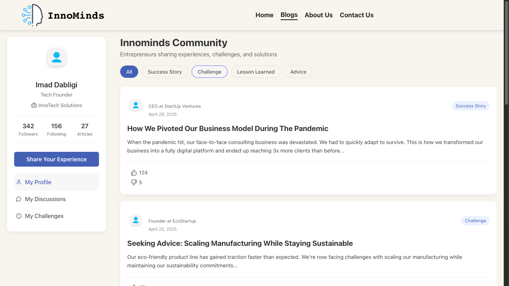

# 🚀 InnoMinds - Entrepreneurial Blog Platform

InnoMinds is a collaborative blog platform built using the MERN stack, designed specifically for entrepreneurs to share their journeys—be it successes, failures, challenges, or advice. This project was built during an intense 36-hour hackathon by a dedicated team of developers passionate about innovation and community learning.

## 🧠 Why InnoMinds?

Entrepreneurship is filled with ups and downs. With InnoMinds, we aimed to create a space where entrepreneurs can:

- Share real-life stories.
- Seek help from others in the community.
- Learn from others’ experiences.
- Connect and grow together.

---

## ⚙️ Tech Stack

- **Frontend**: React.js
- **Backend**: Node.js + Express.js
- **Database**: MongoDB
- **Authentication**: JWT (JSON Web Token)
- **Routing**: React Router DOM
- **UI Styling**: Custom CSS

---

## 🧩 Features

### ✅ Public Pages
- **Landing Page**: Welcome screen with platform introduction and latest featured articles.
- **Authentication**: Sign up and login forms.
- **About Us Page**: Learn more about the vision and team behind InnoMinds.
- **Contact Us Page**: Reach out to us for feedback, inquiries, or support.

### 🧑‍💻 Authenticated Experience
- **Protected Blog Page**: Accessible only with valid JWT token.
- **CRUD Articles**: Authenticated users can:
  - Create their own blog articles.
  - Edit or delete their own articles.
- **React to Posts**:
  - Like or dislike articles (even those by others).
- **Categorized Feed**:
  - Filter articles by categories: 
    - 🏆 Success Story
    - 🚧 Challenge
    - 📚 Lesson Learned
    - 💡 Advice
- **Author Details**: Each post shows the author's name and role.

---

## 📸 Blog Page Preview

Here's a quick look at the main blog page:



---

## 🔐 Route Protection

All blog-related routes are protected and accessible only after authentication using stored JWT tokens.

---

## 👥 Contributors

- **Imad** – Admin and lead frontend developer. Developed the main Blog page with JWT protection and article CRUD functionality.
- **Hanane** – Built the Express backend and connected the application to MongoDB.
- **Asmaa** – Implemented authentication (frontend & backend) and the backend logic for article creation, update, and deletion.
- **Hamza** – Created the About Us page.
- **Soukaina** – Designed and developed the Contact Us page.

---

## 🗃️ Folder Structure

```
InnoMinds/
│
├── frontend/         # React app
│   ├── pages/
│   ├── components/
│   └── ...
│
├── backend/          # Express backend
│   ├── routes/
│   ├── controllers/
│   └── models/
│
└── README.md
```

---

## 🏁 License

This project is open-source and was built for learning and collaboration during a hackathon.

---

## 🌟 Show your support

If you like the project, give it a ⭐ and share it with others in the startup space!
